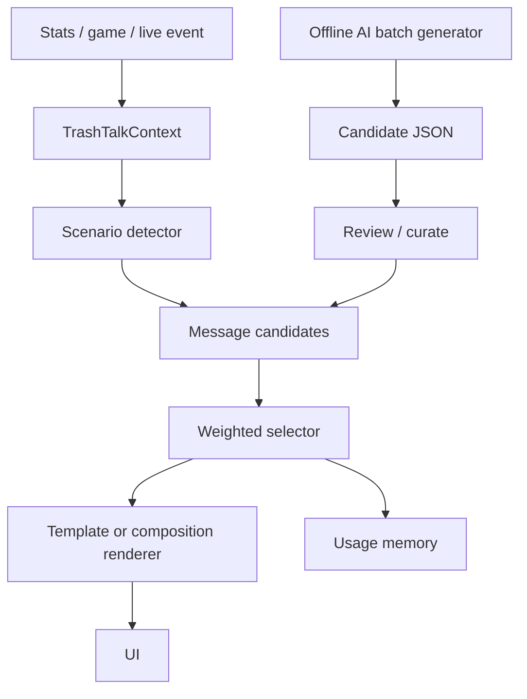

# Trash Talk Engine v2 Plan

## Goal

Replace the current hardcoded one-stat-to-one-text-pool approach with a scenario-driven trash talk engine that can produce many highly varied messages without requiring a live AI connection.

The engine should support:

- many variants per scenario
- different interpretations for the same raw stat
- German-first trash talk
- tone and intensity control
- no live AI dependency
- offline AI-assisted message generation
- local deterministic selection during page rendering or live play
- gradual migration from the existing `frontend/lib/trash-talk.ts` API

## Current System

Current files:

- `frontend/lib/trash-talk.ts`
- `frontend/lib/trash-talk-texts.ts`

Current behavior:

- benchmark functions compute thresholds
- each threshold picks from a static text array
- the frontend receives a `StatBenchmark` with `label`, `detail`, `tone`, and `percent`
- seeded browser-session randomness avoids text changes while navigating in one tab

Limitations:

- each stat has a narrow interpretation
- same score often maps to the same category
- adding variety means making TypeScript files larger
- no metadata per message
- no usage/cooldown tracking beyond seeded selection
- difficult to generate, review, disable, or tag messages at scale

## DB vs JSON

### JSON message bank

Example location:

- `frontend/data/trash-talk/messages.de.json`
- `frontend/data/trash-talk/fragments.de.json`

Pros:

- simple to start
- no backend migration needed
- works offline and in static/frontend code
- easy to version in Git
- easy to review diffs in pull requests
- fast runtime import with `resolveJsonModule`
- good fit for curated baseline content

Cons:

- editing hundreds/thousands of messages in raw JSON becomes annoying
- no built-in admin UI
- usage history is harder unless stored separately
- disabling one message requires code/content deployment
- AI import/review workflow needs scripts or manual editing
- no easy querying/filtering without loading whole JSON

Best for:

- MVP
- curated fallback messages
- local development
- versioned base content
- no live admin needs

### Database message bank

Example tables:

- `trash_talk_messages`
- `trash_talk_fragments`
- `trash_talk_usage`
- `trash_talk_generation_batches`
- `trash_talk_player_profiles`

Pros:

- best maintainability at large scale
- can build admin UI to view, search, edit, approve, disable, and tag messages
- supports review workflow for AI-generated candidates
- supports real usage history and cooldowns
- can hide bad messages immediately without redeploying frontend
- easier to add player-specific and group-specific messages
- easier to collect ratings such as funny/too harsh/repeated
- can import generated batches safely before approval

Cons:

- requires backend schema and API work
- slightly more runtime complexity
- frontend needs fetch/caching logic
- DB backups matter
- more moving parts for local development

Best for:

- thousands of messages
- admin review
- player-specific variants
- AI-generated batch imports
- long-term maintainability
- live system with usage memory

### Recommendation

Use a hybrid:

1. JSON first for the v2 engine and baseline library.
2. Keep runtime selector local and instant.
3. Add backend DB later for generated/approved content and usage history.
4. The selector should read from a common schema so JSON and DB messages are interchangeable.

This keeps the first rewrite low-risk while still leading toward a maintainable long-term system.

## AI Model Choice

Use AI only for offline/batch generation, not live play.

Preferred model:

- `gpt-4.1-mini`

Reasons:

- good German style control
- good instruction following for structured JSON
- strong enough for nuanced scenario variants
- cheaper than large flagship models
- acceptable for generating many short messages in batches

Alternative:

- `gpt-4o-mini` if cost is the primary concern

Important:

- Do not paste API keys into chat.
- Store the key in an environment variable or local `.env` file ignored by Git.
- The production server does not need the key if generation happens offline on the dev machine.

## Target Architecture



## Core Concepts

### TrashTalkContext

A normalized object describing what happened.

Common fields:

- `scope`
- `playerName`
- `score`
- `average`
- `deltaToAverage`
- `won`
- `lost`
- `rank`
- `playerCount`
- `margin`
- `openFrames`
- `cleanFrameRate`
- `strikes`
- `spares`
- `frame`
- `previousScore`
- `trend`
- `seedKey`

The same score can generate different scenarios depending on context.

Example:

- `score = 120`, average unknown → `score.absolute.solid`
- `score = 120`, average 170 → `score.relative.bad`
- `score = 120`, won by 3 → `result.win.cheap`
- `score = 120`, many open frames → `style.chaotic_survival`

### Scenario IDs

Initial taxonomy:

```text
score.absolute.legendary
score.absolute.very_strong
score.absolute.strong
score.absolute.solid
score.absolute.casual
score.absolute.needs_work
score.relative.disaster
score.relative.bad
score.relative.slightly_below
score.relative.on_par
score.relative.above
score.relative.great
score.relative.absurd
result.win.dominant
result.win.cheap
result.loss.close
result.loss.painful
style.open_frames.clean
style.open_frames.controlled
style.open_frames.shaky
style.open_frames.too_many
trend.recovery
trend.fatigue
trend.hot_streak
trend.cold_streak
live.strike
live.double_strike
live.turkey
live.spare
live.open_frame
live.gutter
live.rat_shot
```

### Message schema

```json
{
  "id": "score-relative-bad-001",
  "scenario": "score.relative.bad",
  "language": "de",
  "tone": "savage",
  "intensity": 3,
  "mode": "template",
  "template": "{player}, {score} bei Ø {average}? Deine Normalform hat gerade eine Vermisstenanzeige aufgegeben.",
  "conditions": {
    "requiresAverage": true,
    "minDeltaToAverage": -999,
    "maxDeltaToAverage": -20
  },
  "tags": ["score", "relative", "underperforming"],
  "weight": 1,
  "cooldownGroup": "relative_bad_score"
}
```

### Fragment schema

Fragments allow combinatorial variety.

```json
{
  "scenario": "score.relative.bad",
  "language": "de",
  "intensity": 3,
  "openers": ["{player},", "Ganz ehrlich, {player}:", "Kurze Statistik-Ohrfeige:"],
  "cores": ["das war gegen deine eigene Normalform verloren", "dein Durchschnitt hat gerade weggesehen"],
  "suffixes": ["{delta} Pins unter Schnitt.", "Bei Ø {average} tut {score} schon weh."]
}
```

With 50 openers, 200 cores, and 80 suffixes, one scenario can produce 800,000 combinations.

## Selection Rules

Runtime should:

1. Build context.
2. Detect scenario IDs.
3. Load candidate templates/fragments.
4. Filter by language, intensity, tone, and conditions.
5. Avoid recent repeats by message id and cooldown group.
6. Prefer higher-specificity scenarios over generic ones.
7. Randomly choose using deterministic seed for static pages.
8. Render placeholders.
9. Fall back to existing v1 text if no v2 candidate exists.

## Migration Plan

### Phase 1: v2 beside v1

- Add v2 types, JSON data, selector, and context builder.
- Keep current exported functions.
- Wire one or two benchmark functions to v2 internally.
- Fall back to existing `trash-talk-texts.ts`.

### Phase 2: migrate score messages

- Migrate `scoreBenchmark`, `playerScoreBenchmark`, and `playerLossScoreBenchmark`.
- Add many scenario-aware variants.

### Phase 3: migrate player/day/game details

- Migrate open frame, win rate, strike follow, comeback, fatigue, game report messages.

### Phase 4: AI batch generation

- Add `backend/scripts/generate_trash_talk_bank.py`.
- It should generate candidate JSON.
- Human review before import.

### Phase 5: DB admin mode

- Add DB tables.
- Add admin review UI.
- Support approved/generated/disabled states.
- Track usage history and feedback.

## Safety / Tone Rules

Trash talk should be playful and bowling-specific.

Avoid:

- protected attributes
- real-world hate or slurs
- sexual content
- body shaming
- threats
- self-harm jokes
- overly personal attacks

Prefer:

- pins, lanes, score, statistics, form, rivalry, bowling shoes, gutters
- absurd metaphors
- German dry humor
- adjustable intensity

## First Implementation Scope

Implement:

- `frontend/lib/trash-talk-v2/types.ts`
- `frontend/lib/trash-talk-v2/engine.ts`
- `frontend/data/trash-talk/messages.de.json`
- `frontend/data/trash-talk/fragments.de.json`
- wire `scoreBenchmark` and `playerScoreBenchmark` to v2 as a first proof

Keep old system as fallback.
